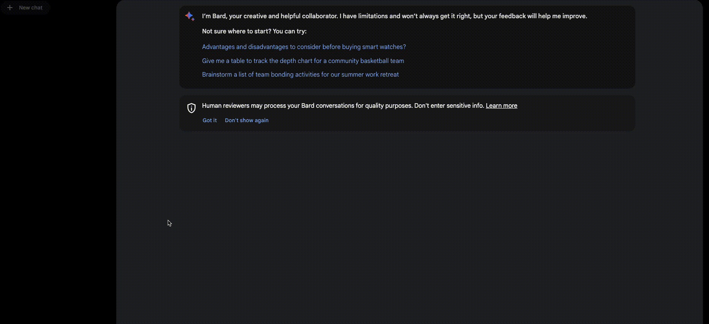

# Bard bot

This bot makes an API call to Google's Bard AI and returns a response based on the user's query.

```py
from textbase import bot, Message
from textbase.models import BardModel
from typing import List

# Load your Bard cookie API key
BardModel.api_key = ""

# Prompt for Bard
SYSTEM_PROMPT = """You are chatting with an AI. There are no specific prefixes for responses, so you can ask or talk about anything you like.
The AI will respond in a natural, conversational manner. Feel free to start the conversation with any question or topic, and let's have a
pleasant chat!
"""

@bot()
def on_message(message_history: List[Message], state: dict = None):

    # Generate Bard response
    bot_response = BardModel.generate(
        system_prompt=SYSTEM_PROMPT,
        message_history=message_history, # Assuming history is the list of user messages
    )

    response = {
        "data": {
            "messages": [
                {
                    "data_type": "STRING",
                    "value": bot_response
                }
            ],
            "state": state
        },
        "errors": [
            {
                "message": ""
            }
        ]
    }

    return {
        "status_code": 200,
        "response": response
    }
```

<br />

# Steps to get Bard API key

1. Open [bard.google.com](https://bard.google.com/)
2. Sign in if you haven't already.
3. Open the developer console (`Ctrl` + `Shift` + `I` on Windows/Linux, `Cmd` + `Option` + `I` on Mac).
4. Go to the Application tab.
5. Expand the Cookies dropdown and select `https://accounts.google.com`.
6. Copy the value of the `__Secure-1PSID` cookie and paste it in place of the `API_KEY`.

<br />

Below is a video demonstrating the steps above.



<br />

# Limitations of Bard

1. Since Google has not released the offical API for Bard, we'll have to use the cookies for authentication.
2. Since Google handles all the conversation history, Bard doesn't remember the context of the conversation. So, if you ask a question and then ask another question, it won't remember the context of the first question.